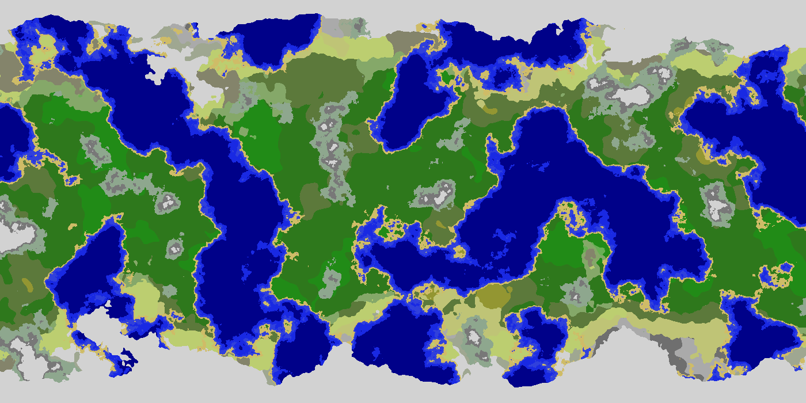
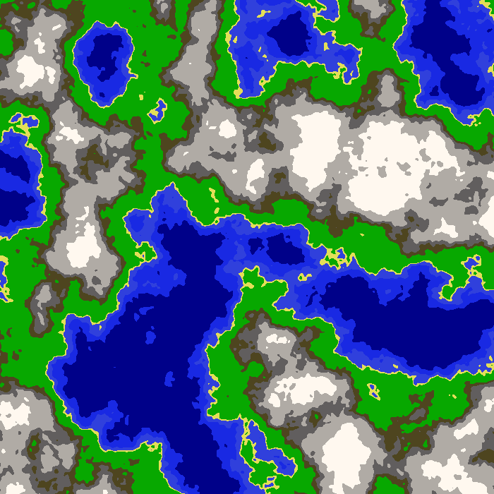
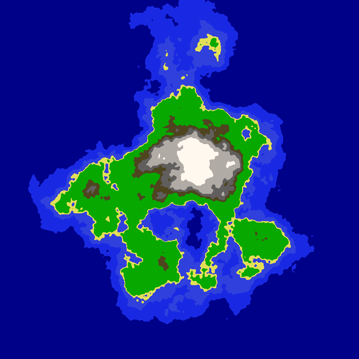

## About the Project
An application using noise functions to procedurally generate two-dimensional maps, built with Java.

Noise libraries used include:
 - [Simplex Noise by Stefan Gustavson](http://webstaff.itn.liu.se/~stegu/simplexnoise/SimplexNoise.java)
 - [Open Simplex Noise by Kurt Spencer](https://gist.github.com/KdotJPG/b1270127455a94ac5d19)

## Project Status
The project is in a working state, but I am still working on adding more features and using the base code to
 experiment with procedural generation.

## Screen Shots

## Installation and Setup Instructions
Open project in Intellij IDEA or a similar IDE and run the `Application` class.

Sample maps have already been generated. Change the parameters of the examples to generate different maps.

## Reflection
I started this project after seeing a procedural map generator somebody had built using Unity. I wanted to make
 something similar but practice my Java skills at the same time, so I decided to build one myself using just Java.
 
#### Things to Add / Further Research
I am still experimenting with:
 - Using temperature and humidity maps along with a height map to create biomes.
 - Adding in an equator to make the map warmer in the middle and colder at the poles.
 - Simulating rivers, wind, and sea currents. Possibly looking at simulating erosion over time.
 - Procedurally placing cities/empires.
 - Ability to edit the map by raising and lowering terrain. Probably need to use some sort of game engine to
  accomplish this. 